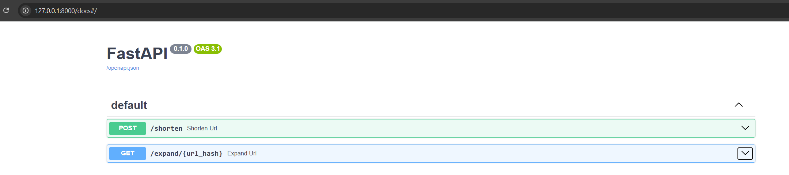

# AplikacjaRozproszona

Testowanie w przeglądarce (Swagger UI)
FastAPI automatycznie generuje interaktywne API pod /docs.

Uruchom serwer (uvicorn main:app --reload).
Otwórz w przeglądarce:
http://127.0.0.1:8000/docs
Dzięki temu można testować API bez żadnych narzędzi zewnętrznych.

Zachowójemy odpowiedź i wklejamy tutaj:

i mamy spowrotem nasz pierwotny URL:

docker-compose up --build

